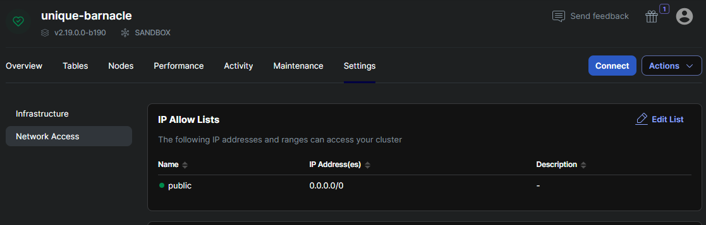
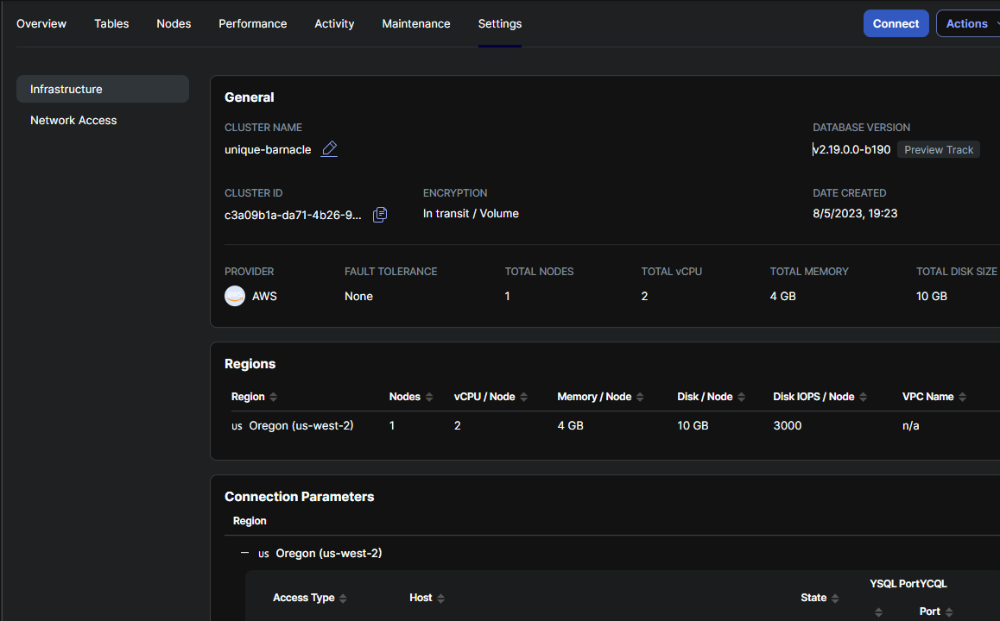

# mind-reader-chatbot
A chatbot aimed to mentally support people who are going through tough times. Powered by MindsDB.

Here's how you can set up an automated AI chatbot for yourself. 

## Prerequisites

- [Get an OpenAI API key](https://www.howtogeek.com/885918/how-to-get-an-openai-api-key/)
- [Set up mindsdb locally](https://docs.mindsdb.com/setup/self-hosted/pip/source)
- Configure YugabyteDB
  - [Create an account](https://cloud.yugabyte.com/signup?utm_medium=direct&utm_source=docs&utm_campaign=YBM_signup) & a free cluster. Take a note of your DB credentials.   
    Configure IP allow list  
    
    Launch cloud shell and login using DB credentials
    
  - Run the following commands:  
    `create database demo;`  
    Connect to database:  
    `\c demo`  
    ```
      CREATE TABLE chatbot_input (
       id SERIAL PRIMARY KEY,  
       created_at timestamptz DEFAULT CURRENT_TIMESTAMP,
       text varchar(255)
    );
    ```
    ```
    CREATE TABLE chatbot_output (
       id SERIAL PRIMARY KEY,  
       created_at timestamptz DEFAULT CURRENT_TIMESTAMP,
       text varchar(1000)    
    );  
    ```
  - Take a note of the host under connection parameters:  
    

## Usage

Head over to [queries.sql](queries.sql) file. You can run the commands line by line to create your own mind-reader chatbot.